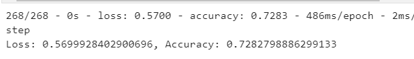

# Neural_Network_Charity_Analysis

## Overview
Create a binary classifier that is capable of predicting whether applicants will be successful if funded by Alphabet Soup.

From Alphabet Soup’s business team, a CSV containing more than 34,000 organizations that have received funding from Alphabet Soup over the years has been used to construct a neural network analysis. 

Within this dataset are a number of columns that capture metadata about each organization, such as the following:

* EIN and NAME—Identification columns
* APPLICATION_TYPE—Alphabet Soup application type
* AFFILIATION—Affiliated sector of industry
* CLASSIFICATION—Government organization classification
* USE_CASE—Use case for funding
* ORGANIZATION—Organization type
* STATUS—Active status
* INCOME_AMT—Income classification
* SPECIAL_CONSIDERATIONS—Special consideration for application
* ASK_AMT—Funding amount requested
* IS_SUCCESSFUL—Was the money used effectively

used these columns to check what information was absolutely necessary or what could be dropped as I moved through the model.

Looked at application types to help preprocess our data.

## Results

* Encoded with OneHotEncoder
* replaced the original columns with OneHotEncoders encoded features
* Train, Fit/test and Scaled the data

First Model

Additional models 2 & 3 did not give much optimization

## Summary

I was unable to optimize the data above the 75% mark and will need to keep at it. Possibly do some more randomization to standarize the data a bit better and add more neurons.